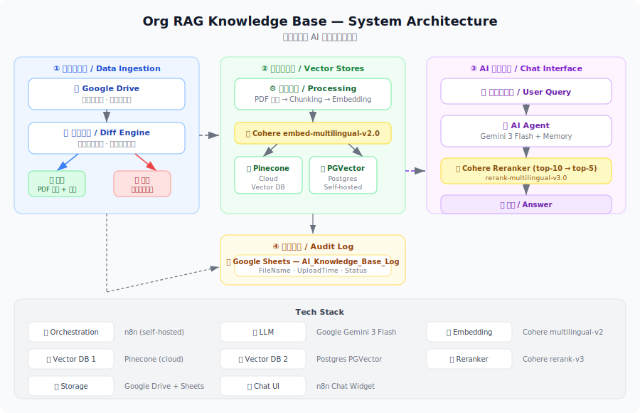

# 🗂️ Org RAG Knowledge Base

> **An automated AI-powered knowledge base that lets your team ask questions about internal documents in plain language.**
>
> **讓團隊用自然語言向公司內部文件提問的 AI 知識庫系統。**

---

## ✨ What It Does / 這個系統做什麼

Imagine uploading a PDF to a shared Google Drive folder — and within one minute, your entire team can ask an AI chatbot questions about its content, in any language, without any manual setup.

想像你把一份 PDF 上傳到共用 Google Drive，一分鐘內，團隊成員就能用自然語言向 AI 詢問文件內容，無需任何人工設定。

**Demo flow / 示範流程：**

```
1. 員工將 PDF 上傳至 Google Drive 資料夾
        ↓ (自動，約 1 分鐘內)
2. 系統偵測新檔案，解析並建立向量索引
        ↓
3. 任何人透過聊天介面提問
        ↓
4. AI 搜尋相關段落 → Reranker 精選最佳結果 → 生成回答
```

---

## 🏗️ Architecture / 系統架構



### Four Core Subsystems / 四大子系統

| # | Subsystem | Description | 說明 |
|---|-----------|-------------|------|
| ① | **Data Ingestion** | Auto-syncs Google Drive with vector DB | 自動將 Google Drive 檔案同步至向量資料庫 |
| ② | **Vector Stores** | Dual-backend: Pinecone + PGVector | 雙向量資料庫備援架構 |
| ③ | **Chat Interface** | AI agent with memory & reranking | 具備多輪對話記憶與重排序的 AI 問答 |
| ④ | **Audit Log** | Google Sheets tracks all indexed files | Google Sheets 追蹤所有已索引文件 |

---

## ⚙️ Tech Stack / 技術堆疊

| Component | Technology | Role |
|-----------|-----------|------|
| Orchestration | [n8n](https://n8n.io) | Workflow automation |
| LLM | Google Gemini 3 Flash | Answer generation |
| Embedding | Cohere `embed-multilingual-v2.0` | Multi-language vector encoding |
| Reranker | Cohere `rerank-multilingual-v3.0` | Result quality improvement |
| Vector DB (cloud) | [Pinecone](https://pinecone.io) | Primary vector search |
| Vector DB (self-hosted) | Postgres PGVector | Secondary / backup vector search |
| File storage | Google Drive | Source-of-truth document storage |
| Audit log | Google Sheets | File ingestion tracking |

---

## 🔄 Key Design Decisions / 設計決策說明

### 1. Google Drive as the Single Source of Truth
Rather than building a custom upload UI, Google Drive acts as the document store. This means non-technical users can manage the knowledge base simply by adding or removing files from a shared folder — no dashboards or admin access required.

以 Google Drive 作為唯一文件來源，非技術人員只需管理資料夾即可更新知識庫，無需任何後台操作。

### 2. Dual Vector Database (Pinecone + PGVector)
The system writes documents to both Pinecone (managed cloud) and PGVector (self-hosted Postgres). This provides redundancy and allows cost/latency tradeoffs to be evaluated in production.

雙寫架構同時將資料存入 Pinecone（雲端託管）與 PGVector（自架 Postgres），確保可用性並保留未來切換的彈性。

### 3. Two-Stage Retrieval: Embedding + Reranking
- **Stage 1:** Retrieve top-10 candidates via semantic vector search
- **Stage 2:** Cohere Reranker re-scores them and returns the best 5

This two-stage approach significantly improves answer precision compared to raw vector similarity alone.

兩階段檢索：先向量搜尋取 top-10，再透過 Cohere Reranker 精選 top-5，大幅提升回答精準度。

### 4. Bidirectional Sync with Diff Detection
Every minute, the system compares Google Drive contents against the audit log in Google Sheets:
- **New file detected** → parse, embed, insert to vector DBs, log to Sheet
- **File removed** → delete vectors from Pinecone, remove log from Sheet

每分鐘雙向差異比對，自動處理新增與刪除，確保知識庫內容與 Drive 資料夾保持一致。

### 5. Safe Row Deletion (Descending Sort)
When removing multiple rows from Google Sheets, rows are deleted from the **bottom up** (sorted by `row_number` descending). This prevents row number shifting from corrupting subsequent deletions.

Google Sheets 批次刪除時採用降序排列，從下往上刪除，避免行號偏移造成錯誤刪除。

---

## 📁 Repository Structure / 專案結構

```
org-rag-project/
├── README.md               # This file
├── docs/
│   └── architecture.svg    # System architecture diagram
└── workflow/
    └── org.json            # n8n workflow export (importable)
```

---

## 🚀 How to Import / 如何匯入

> **Prerequisites / 前置需求**
> - n8n instance (self-hosted or cloud)
> - Google account with Drive & Sheets access
> - Pinecone account + index named `org`
> - Postgres instance with PGVector extension
> - Cohere API key
> - Google Gemini API key

**Steps / 步驟：**

1. Open your n8n instance → **Workflows** → **Import from file**
2. Select `workflow/org.json`
3. Configure credentials for: Google Drive, Google Sheets, Pinecone, Postgres, Cohere, Gemini
4. Update the Google Drive folder ID in the trigger node (`監聽雲端硬碟資料夾...`)
5. Update the Google Sheets document ID (`AI_Knowledge_Base_Log`)
6. Activate the workflow

---

## 🗺️ Roadmap / 未來規劃

- [ ] Support non-PDF formats (Word, PowerPoint, Markdown)
- [ ] Per-file access control / permission scoping
- [ ] Query logging and analytics dashboard
- [ ] Unified deletion across both Pinecone and PGVector
- [ ] Docker Compose setup for one-command local deployment

---

## 📝 Notes / 備註

- The manual upload/delete form-based workflows are currently **disabled** — superseded by the automatic Drive sync
- PGVector insert path currently does not store `filename` metadata; targeted deletion by filename for PGVector is a known gap
- The Gemini model used (`gemini-3-flash-preview`) may require API access approval depending on your region

---

## 📄 License

MIT
